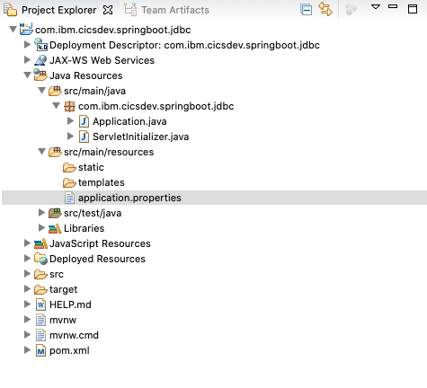
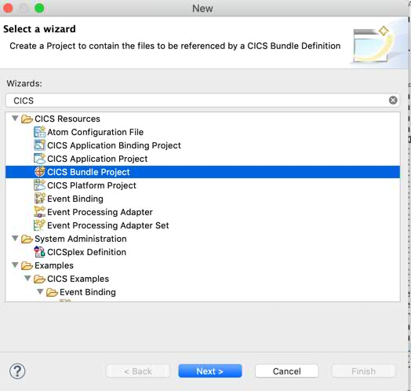
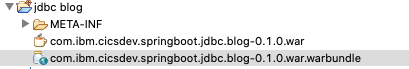
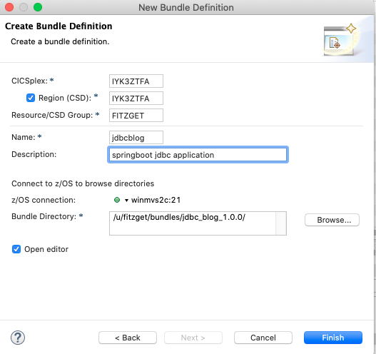

# Learning Objectives
Accessing a relational database from your SPringboot application is likely to be an essential requirement for your application. This tutorial demonstrates how to create a Java application which accesses a relational database using Spring Boot's approach to JDBC. The application is destined to be deployed into a Liberty server, running in CICS. 

1. We will Create a Spring Boot app that uses JDBC and setup a Maven/Gradle build for this
1. Use JDBC Template to access a data source
1. Configure a Datasource to define the connection to the database
1. Deploy and test the app in CICS/Liberty


JDBC is a Java API which allows a Java applications to access data stored in a relational database. In this tutorial we will be using IBM Db2® for z/OS as our relational database. The application will use the supplied EMP table which is supplied with DB2. 

Spring Boot JDBC supplies database related beans such as DataSource and JdbcTemplate,  which can be Autowired into an application to facilitate the usage of JDBC in the application. Follow the steps in this article to generate a Spring Boot web application which can then be built using either Gradle or Maven and deployed in a CICS Liberty JVM server and used to update the Db2 employee table  


The application will allow you to:

1. add an employee to the EMP table
1. list all or a single employee 
1. update an existing employee
1. delete an existing employee.  


# The Application
The application is a web application where all requests can be made from a browser. The application uses the Spring Boot web interface to process GET REST requests only. In a real world implementation of this other types of REST interfaces, such as POST, would be more appropriate. GET requests are used here for simplicity.


The application source and build scripts are available from github at cics-java-liberty-springboot-jdbc. 

# Generate the Spring web application
Generate the Spring Boot Java web application using the website https://start.spring.io/ with the following selections:
- __Project:__ Maven Project
- __Language:__ Java
- __Spring Boot:__ 2.3.0
- __Project Metadata
  - __Group:__ com.ibm.cicsdev
  - __Artifact:__ com.ibm.cicsdev.springboot.jdbc
  - __Name:__ com.ibm.cicsdev.springboot.jdbc
  - __Description:__ Demo project for Spring Boot JDBC
  - __Package Name:__ com.ibm.cicsdev.springboot.jdbc
  - __Packaging:__ War
  - __Java:__ 8


From the Dependencies portion of the screen, click ADD DEPENDENCIES and select/find *Spring Data JDBC* and *Spring Web*. This will ensure that the correct dependancies are added to the **pom.xml** file (for Maven) or the **build.gradle** file for Gradle builds.

 

Click on *Generate*, download and unzip the sample project. This can then be imported into your your IDE. This blog will describe importing the project in to Eclipse.


# Import into Eclipse
Import the project by: 
1. selecting **File > Import > Existing Maven Project**.
1. navigate to the root directory of the application (the one you just unzipped)
the project box should show the pom.xml file for the application and it should be checked. 
1. Click Finish

With the Java source expanded it should look similar to the following once the application has downloaded all its dependencies and the application has correctly built.

 


We now have a basic application which does not at this point do anything.


# Construct the application

We will now add the various pieces of code to the application which will allow us to access the data in the EMP table in Db2.


## Add a class to define the data object(s)


This example application will make use of a supplied Db2 table which contains employee data. The supplied table should be found on your Db2 for z/OS system in database DSN8D11A. The DDL for this table can be found in the Db2 for z/OS Knowledge Center at the folloiwng location https://www.ibm.com/support/knowledgecenter/SSEPEK_11.0.0/intro/src/tpc/db2z_sampletablesemployeemain.html


We need to have a representation of this table in our application so the first item we need to add is a definition of an employee object. This is done in the Employee.java class

```
package com.ibm.cicsdev.springboot.jdbc;


import java.sql.Date;


public class Employee {
    
    /*
     * Db2 supplied EMP table 
     * 
     * CREATE TABLE DSN81110.EMP                                           
   (EMPNO                CHAR(6) FOR SBCS DATA NOT NULL,            
    FIRSTNME             VARCHAR(12) FOR SBCS DATA NOT NULL,        
    MIDINIT              CHAR(1) FOR SBCS DATA NOT NULL,            
    LASTNAME             VARCHAR(15) FOR SBCS DATA NOT NULL,        
    WORKDEPT             CHAR(3) FOR SBCS DATA WITH DEFAULT NULL,   
    PHONENO              CHAR(4) FOR SBCS DATA WITH DEFAULT NULL,   
    HIREDATE             DATE WITH DEFAULT NULL,                    
    JOB                  CHAR(8) FOR SBCS DATA WITH DEFAULT NULL,   
    EDLEVEL              SMALLINT WITH DEFAULT NULL,                
    SEX                  CHAR(1) FOR SBCS DATA WITH DEFAULT NULL,   
    BIRTHDATE            DATE WITH DEFAULT NULL,                    
    SALARY               DECIMAL(9, 2) WITH DEFAULT NULL,           
    BONUS                DECIMAL(9, 2) WITH DEFAULT NULL,           
    COMM                 DECIMAL(9, 2) WITH DEFAULT NULL,           
    CONSTRAINT EMPNO                                                
    PRIMARY KEY (EMPNO),                                            
    CONSTRAINT NUMBER                                               
      CHECK (PHONENO >= '0000' AND PHONENO <= '9999'),              
    CONSTRAINT PERSON CHECK (SEX = 'M' OR SEX = 'F'))               
  IN DSN8D11A.DSN8S11E                                              
  PARTITION BY (EMPNO ASC)                                          
   (PARTITION 1 ENDING AT ('099999'),                               
    PARTITION 2 ENDING AT ('199999'),                               
    PARTITION 3 ENDING AT ('299999'),                               
    PARTITION 4 ENDING AT ('499999'),                               
    PARTITION 5 ENDING AT ('999999'))                               
  EDITPROC  DSN8EAE1 WITH ROW ATTRIBUTES                            
  AUDIT NONE                                                        
  DATA CAPTURE NONE                                                 
  CCSID      EBCDIC                                                 
  NOT VOLATILE                                                      
  APPEND NO  ;                                                      
     */
    
    
    
    private String empNo;
    private String firstNme;
    private String midinit;
    private String lastName;
    private String workdept;
    private String phoneNo;
    private Date hireDate;
    private String job;
    private int edLevel;
    private String sex;
    private String birthDate;
    private long salary;
    private long bonus;
    private long comm;


    
    public Employee(String empNo, String firstNme, String midinit, String lastName, String workdept, String phoneNo,
            Date hireDate, String job, int edLevel, String sex, String birthDate, long salary, long bonus, long comm) {
        super();
        this.empNo = empNo;
        this.firstNme = firstNme;
        this.midinit = midinit;
        this.lastName = lastName;
        this.workdept = workdept;
        this.phoneNo = phoneNo;
        this.hireDate = hireDate;
        this.job = job;
        this.edLevel = edLevel;
        this.sex = sex;
        this.birthDate = birthDate;
        this.salary = salary;
        this.bonus = bonus;
        this.comm = comm;
    }


    @Override
    public String toString() {
        return "Employee [empNo=" + empNo + 
                ", firstName=" + firstNme + 
                ", midinit=" + midinit + 
                ", lastName=" + lastName + 
                ", workdept=" + workdept + 
                ", phoneNo=" + phoneNo + 
                ", hireDate=" + hireDate + 
                ", job=" + job + 
                ", edLevel=" + edLevel + 
                ", sex=" + sex + 
                ", birthDate=" + birthDate + 
                ", salary=" + salary + 
                ", bonus=" + bonus + 
                ", comm=" + comm + "]";
    }


    public String getEmpNo() {
        return empNo;
    }


    public void setEmpNo(String empNo) {
        this.empNo = empNo;
    }


    public String getFirstName() {
        return firstNme;
    }


    public void setFirstName(String firstName) {
        this.firstNme = firstName;
    }


    public String getMidinit() {
        return midinit;
    }


    public void setMidinit(String midinit) {
        this.midinit = midinit;
    }


    public String getLastName() {
        return lastName;
    }


    public void setLastName(String lastName) {
        this.lastName = lastName;
    }


    public String getWorkdept() {
        return workdept;
    }


    public void setWorkdept(String workdept) {
        this.workdept = workdept;
    }


    public String getPhoneNo() {
        return phoneNo;
    }


    public void setPhoneNo(String phoneNo) {
        this.phoneNo = phoneNo;
    }


    public Date getHireDate() {
        return hireDate;
    }


    public void setHireDate(Date hireDate) {
        this.hireDate = hireDate;
    }


    public String getJob() {
        return job;
    }


    public void setJob(String job) {
        this.job = job;
    }


    public int getEdLevel() {
        return edLevel;
    }


    public void setEdLevel(int edLevel) {
        this.edLevel = edLevel;
    }


    public String getSex() {
        return sex;
    }


    public void setSex(String sex) {
        this.sex = sex;
    }


    public String getBirthDate() {
        return birthDate;
    }


    public void setBirthDate(String birthDate) {
        this.birthDate = birthDate;
    }


    public long getSalary() {
        return salary;
    }


    public void setSalary(long salary) {
        this.salary = salary;
    }


    public long getBonus() {
        return bonus;
    }


    public void setBonus(long bonus) {
        this.bonus = bonus;
    }


    public long getComm() {
        return comm;
    }


    public void setComm(long comm) {
        this.comm = comm;
    }


    
}
```

This is a standard java representation of our employee record which contains definitions for each column in the table, a constructor and getters and setters for each field.


## Add a REST Controller


The REST controller is the code which will process the requests coming in from the browser. It will direct the incoming requests to the appropriate service method to complete the request.


Code for EmployeeRestController.java

```  
package com.ibm.cicsdev.springboot.jdbc;


import java.text.SimpleDateFormat;
import java.util.Date;
import java.util.List;


import javax.naming.NamingException;


import org.springframework.beans.factory.annotation.Autowired;
import org.springframework.web.bind.annotation.PathVariable;
import org.springframework.web.bind.annotation.RequestMapping;
import org.springframework.web.bind.annotation.ResponseBody;
import org.springframework.web.bind.annotation.RestController;


@RestController
public class EmployeeRestController {
    /*    
     *  REST controller used to direct incoming requests to the correct business service.
     *  
     *  In a real world application some of these functions would most likely be done by a POST
     *    request. For simplicity all requests to this sample application are done with a GET request
     *    
     */


    @Autowired  
    private EmployeeService employeeService;


    // Simple endpoint - returns date and time - simple test of the application
    @RequestMapping("/") 
    @ResponseBody
    public String Index()
    {    
        Date myDate = new Date();
        SimpleDateFormat sdf = new SimpleDateFormat("yyyy-MM-dd:HH-mm-ss.SSSSSS");
        String myDateString = sdf.format(myDate);
        return "Hello from employee service controller. Date/Time: " + myDateString;
    }


    /*
     *    example url http://<server>:<port>/allRows
     */
    @RequestMapping(value={"/allRows","/allRows/"})
    public List<Employee> getAllRows() throws NamingException {
        return employeeService.selectAll();
    }
    
    /*
     *    example url http://<server>:<port>/allRows2
     */
    @RequestMapping(value={"/allRows2","/allRows2/"})
    public List<Employee> getAllRows2() throws NamingException {
        return employeeService.selectAllUsingBeanDataSource();
    }
    /*
     *    example url http://<server>:<port>/oneEmployee/000100
     */
    @RequestMapping("/oneEmployee/{empno}")
    public List<Employee> oneEmployee(@PathVariable String empno) {
        return employeeService.selectWhereEmpno(empno);
    }
    
    /*
     *    example url http://<server>:<port>/addEmployee/Tony/Fitzgerald
     */
    @RequestMapping("/addEmployee/{firstName}/{lastName}")
    @ResponseBody
    public String addEmp(@PathVariable String firstName , @PathVariable String lastName) {
        String result = employeeService.addEmployee(firstName,lastName);
        return result;
    }
    
    /*
     *    example url http://<server>:<port>/deleteEmployee/368620
     */
    @RequestMapping("/deleteEmployee/{empNo}")
    @ResponseBody
    public String delEmployee(@PathVariable String empNo) {
        String result = employeeService.deleteEmployee(empNo);
        return result;
    }
    
    /*
     *  example url http://<server>:<port>/updateEmployee/368620/33333
     */
    @RequestMapping("/updateEmployee/{empNo}/{newSalary}")
    @ResponseBody
    public String updateEmp(@PathVariable String empNo, @PathVariable int newSalary) {
        String result = employeeService.updateEmployee(newSalary, empNo);
        return result;
    }


    
}
```

## Add Service class

The REST controller contains an @Autowired annotation:

```
@Autowired  
private EmployeeService employeeService;
```


which enables the controller methods to call methods which service the incoming requests.  This service class makes the calls to the database using the jdbcTemplate class supplied by Spring. It is also often calls the dao(data access object) class. 


jdbcTemplate _"is the central class in the JDBC core package. It simplifies the use of JDBC and helps to avoid common errors. It executes core JDBC workflow, leaving application code to provide SQL and extract results. This class executes SQL queries or updates, initiating iteration over ResultSets and catching JDBC exceptions and translating them to the generic, more informative exception hierarchy defined in the org.springframework.dao package"._    

(from https://docs.spring.io/spring-framework/docs/current/javadoc-api/org/springframework/jdbc/core/JdbcTemplate.html  )


jdbcTemplate in this example application uses the query and update methods of that class. The jdbcTemplate in each case is passed a piece of SQL as a string and any result sets are processed by jdbcTemplate and returned in the appropriate object. In the case of the queries using the update method the jdbcTemplate.update returns an integer indicating the number of rows which have been affected by the update. 
 
The service class for this application EmployeeService.java is as follows:


```
package com.ibm.cicsdev.springboot.jdbc;


import java.time.LocalDateTime;
import java.time.format.DateTimeFormatter;
import java.util.List;


import javax.naming.NamingException;
import javax.sql.DataSource;


import org.springframework.beans.factory.annotation.Autowired;
import org.springframework.jdbc.core.JdbcTemplate;
import org.springframework.stereotype.Service;


@Service
public class EmployeeService {


    //    private DataSource dataSource;    


    @Autowired
    private JdbcTemplate jdbcTemplate;    


    @Autowired
    private DataSource datasource2;


    public List<Employee> selectAll() throws NamingException {
        /*
         * Select all rows from the emp table
         * 
         *   datasource information comes from the application.properties file in the resources directory
         *   
         */


        //setup the select SQL
        String sql = "SELECT * FROM emp";


        //run the query
        return jdbcTemplate.query(
                sql,
                (rs, rowNum) ->
                new Employee(
                        rs.getString("EMPNO"),
                        rs.getString("FIRSTNME"),
                        rs.getString("MIDINIT"),
                        rs.getString("LASTNAME"),
                        rs.getString("WORKDEPT"),
                        rs.getString("PHONENO"),
                        rs.getDate("HIREDATE"),
                        rs.getString("JOB"),
                        rs.getInt("EDLEVEL"),
                        rs.getString("SEX"),
                        rs.getString("BIRTHDATE"),
                        rs.getLong("SALARY"),
                        rs.getLong("BONUS"),
                        rs.getLong("COMM")));


    }


    public List<Employee> selectAllUsingBeanDataSource() throws NamingException {
        /*
         * Select all rows from the emp table
         * 
         * Identical to preceding selectAll() method except that the 
         *   datasource information comes injected Bean datasource2
         *   this will override the setting in the application.properties file
         */


        //set the data source from the injected bean
        jdbcTemplate = new JdbcTemplate(datasource2);        


        //set up the select SQL
        String sql = "SELECT * FROM emp";


        //run the query
        return jdbcTemplate.query(
                sql,
                (rs, rowNum) ->
                new Employee(
                        rs.getString("EMPNO"),
                        rs.getString("FIRSTNME"),
                        rs.getString("MIDINIT"),
                        rs.getString("LASTNAME"),
                        rs.getString("WORKDEPT"),
                        rs.getString("PHONENO"),
                        rs.getDate("HIREDATE"),
                        rs.getString("JOB"),
                        rs.getInt("EDLEVEL"),
                        rs.getString("SEX"),
                        rs.getString("BIRTHDATE"),
                        rs.getLong("SALARY"),
                        rs.getLong("BONUS"),
                        rs.getLong("COMM")));
    }


    public List<Employee> selectWhereEmpno(String empNo) {
        /*
         * Return all rows for a specific employee number
         * 
         *   datasource information comes from the application.properties file in the resources directory
         *   
         */


        String sql = "SELECT * FROM emp where empno = ?";


        return jdbcTemplate.query(
                sql,
                new Object [] {empNo},
                (rs, rowNum) ->
                new Employee(
                        rs.getString("EMPNO"),
                        rs.getString("FIRSTNME"),
                        rs.getString("MIDINIT"),
                        rs.getString("LASTNAME"),
                        rs.getString("WORKDEPT"),
                        rs.getString("PHONENO"),
                        rs.getDate("HIREDATE"),
                        rs.getString("JOB"),
                        rs.getInt("EDLEVEL"),
                        rs.getString("SEX"),
                        rs.getString("BIRTHDATE"),
                        rs.getLong("SALARY"),
                        rs.getLong("BONUS"),
                        rs.getLong("COMM")));
    }


    public String addEmployee(String fName, String lName) {
        /*
         *  Add a new employee.
         *      Firstname and lastname are passed in 
         *      
         *      for demo purposes all the other fields are set by this method
         *      
         *  datasource information comes from the application.properties file in the resources directory
         *  
         */


        //generate an empNo between 300000 and 999999
        int max = 999999;
        int min = 300000;
        String empno = String.valueOf((int) Math.round((Math.random()*((max-min)+1))+min));


        //for demo purposes hard code all the remaining fields (except first name and last name) 
        String midInit = "A";
        String workdept = "E21";
        String phoneNo = "1234";


        //get today's date and set as hiredate
        DateTimeFormatter dtf = DateTimeFormatter.ofPattern("yyyy-MM-dd");  
        LocalDateTime now = LocalDateTime.now();  
        String hireDate= dtf.format(now);  


        String job = "Engineer";
        int edLevel =3 ;
        String sex ="M";
        String birthDate = "1999-01-01" ;
        long salary = 20000;
        long bonus= 1000;
        long comm = 1000;


        //setup the SQL
        String sql = "insert into emp (EMPNO, FIRSTNME, MIDINIT,LASTNAME,WORKDEPT,PHONENO,HIREDATE,JOB,EDLEVEL,SEX,BIRTHDATE,SALARY,BONUS,COMM) values(?,?,?,?,?,?,?,?,?,?,?,?,?,?)";


        //do the insert
        int numRows =  jdbcTemplate.update (sql,
                empno,
                fName,
                midInit,
                lName,
                workdept,
                phoneNo,
                hireDate,
                job,
                edLevel,
                sex,
                birthDate,
                salary,
                bonus,
                comm);


        //numRows is the number of rows inserted - will be zero if the insert fails
        if (numRows > 0) 
        {
            return "employee " + empno + " added";
        } else
        {
            return "employee insert failed try again";
        }
    }


    public String deleteEmployee(String empNo)
    /*
     *  Delete an employee based on the empNo passed in
     *  
     *    datasource information comes from the application.properties file in the resources directory
     *    
     */
    {
        //set up the delete SQL
        String sql = "DELETE FROM emp WHERE empno =?";


        //do the delete
        int numRows = jdbcTemplate.update(sql, empNo);


        //numRows is the number of rows deleted - will be zero if the delete fails
        if (numRows > 0) 
        {
            return "employee " + empNo + " deleted";
        } else
        {
            return "employee delete failed try again";
        }
    }


    public String updateEmployee(int newSalary, String empNo) {
        /*
         * Update a specified employee's salary based on the empNo passed to the salary passed in.
         * 
         *   datasource information comes from the application.properties file in the resources directory
         *   
         */


        //set up the update SQL
        String sql = "update emp set salary =? where empNo = ?";


        //do the update
        int numRows = jdbcTemplate.update(sql, newSalary, empNo);


        //numRows is the number of rows updated - will be zero if the update fails   
        if (numRows > 0) 
        {
            return "employee " + empNo + " salary changed to " + newSalary;
        } else
        {
            return "employee update failed try again";
        }


    }
}
```


## Update the Application.java file


We need to add a datasource bean to the application which will be used by one of the REST interfaces in the EmployeeRestController to demonstrate the use of the DataSourceBean


add the following method to the class 

```
    @Bean
    public DataSource dataSource() {        
        try {
            // Look up the connection factory from Liberty
            DataSource ds = InitialContext.doLookup(DATA_SOURCE);
            return ds;
        } catch (NamingException e) {
            e.printStackTrace();
            return null;
        }
    } 

```
and also the following constant definition

```
    // name the dataSource jndi name
    private static final String DATA_SOURCE = "jdbc/jdbcDataSource";
```


the value of the constant can be somnthing else of your chosing, but it must match the value we will set later in the datasource defintion we will create in our server.xml in a forthcoming step in this blog.


You will need to resolve some imports when you paste the bean code into the class.

```
import org.springframework.context.annotation.Bean;
import javax.naming.InitialContext;
import javax.naming.NamingException;
import javax.sql.DataSource;
```

## Configure application.properties
In the src/main/resources directory edit the application.properties file to contain the following line

```
spring.datasource.jndi-name=jdbc/jdbcDataSource
```

the name value should match exactly the jndi name which will be specified in the dataSource definition which we will add to server.xml later in this blog.


## Add a web.xml to the application
To avoid the warnings about using BLANK and default CICS userid, you need to include a simple web.xml to the application to enable basic authentication. This is described in the blog [Spring Boot Java applications for CICS - Part 2 - Security](https://github.com/cicsdev/cics-java-liberty-springboot-security/blob/master/blog/blog.md)


## Build the application

We have now completed all the tasks required to develop our application. The next thing we must do is to build the application and deploy it to CICS.


Building the application can be done using Maven by right clicking (in Eclipse) the pom.xml file and selecting the appropriate Run option to ask Maven to build the application.


If you subsequently add JCICS calls to this application then you will need to add the appropriate dependancies to your pom.xml or build.gradle files. This are described in the blog [Spring Boot Java applications for CICS, Part 1: JCICS, Gradle, and Maven](https://developer.ibm.com/tutorials/spring-boot-java-applications-for-cics-part-1-jcics-maven-gradle/)

# Liberty configuration

To deploy the sample into a CICS Liberty JVM server you will need to first build build the application as a WAR. Maven pom.xml and Gradle build.gradle files are provided in the sample Git repository to simplify this task. You will then need to

* Configure your CICS Liberty JVM server to use a SAF user registry
* Define the application to the Liberty server using an <application> element in the Liberty server.xml just as we did for scenario 1
* Configure an authorization method, using either Java EE roles or EJBROLE profiles defined in SAF.
* Start the Liberty server and start the application using the following example url 
   * http://<your host name>:<your port number>/com.ibm.cicsdev.springboot.jdbc-0.1.0/
  
  this will display a screen which looks as follows:
  
---
``` 
Spring Boot JDBC Employee REST sample. Date/Time: 2020-08-25:11-14-31.000188       
Usage: 

/allRows - return a list of employees using a classic SELECT statement 
/oneEmployee/{empno} - a list of employee records for the employee number provided 
/addEmployee/{firstName}/{lastName} - add an employee 
/deleteEmployee/{empNo} - delete an employee 
/updateEmployee/{empNo}/{newSalary} - update employee salary 
```
---


# Deploy the WAR into a CICS Liberty JVM server
There are two ways to deploy the WAR. 
1. You can add an <application> element to your server.xml which points to your uploaded WAR file location.
2. You can use a CICS bundle. In this article, we will introduce how to deploy the Spring Boot WAR as a WAR bundlepart with a CICS bundle.


# Define the application to CICS with a CICS Bundle project

a) Create a new CICS Bundle Project with id "com.ibm.cicsdev.springboot.jdbc.cicsBundle"


 

Copy the WAR file into this CICS Bundle Project and then add a .warbundle file

 


The content of the warbundle should be as follows:

``` xml
<?xml version="1.0" encoding="UTF-8" standalone="yes"?>
<warbundle symbolicname="com.ibm.cicsdev.springboot.jdbc.blog-0.1.0" jvmserver="YourJVMServerName"/>
```

(where YourJVMServerName is the JVM server where the application will run)


This warbundle file can be created by right clicking the CICS bundle project and then:

* clicking New --> other
* from the Select a Wizzard window - open CICS Resources and then click Dynamic Web Project Include
* click Next 
*click the web artifact you wish to include (the war file)
* enter the JVM server name that the application will run on


b) Right-click the CICS Bundle Project and then click Export Bundle Project to z/OS UNIX File System. This will place the bundle in a directory on the USS system which you can then point to with a CICS Bundle defintion in CICS


c) Create a new CICS Bundle like this:




d) Start and enable your CICS Liberty JVM server. If you don't yet have a Liberty JVM server configured, using CICS auto-configuration is a great way to start. If you enable auto-configuration in the JVM profile, it will generate a basic server.xml when the JVM server is enabled. For more information, see Configuring a Liberty JVM server in the CICS Knowledge Center. 


e) Customize the server.xml to add the elements necessary to run the JDBC aplication. You need to ensure you include the following features:

* servlet-3.1 or servlet-4.0
* cicsts:security-1.0
* jdbc-4.0 or jdbc-4.1
* jsp-2.3


f) Add DataSource elements and a library id element to define the connection to DB2 from Liberty


```xml
  <dataSource id="t4a"  jndiName="jdbc/jdbcDataSource" type="javax.sql.DataSource">
         <jdbcDriver libraryRef="db2Lib"/>
        <properties.db2.jcc currentSchema="DSN81110" databaseName="DSNV11P2" driverType="4" password="+++++++++++++"
                      portNumber="<port num>" serverName="<your server name>" user="<user id"/>
  </dataSource>
 
  <library id="db2Lib">
        <fileset dir="/usr/lpp/db2v11/jdbc/classes" includes="db2jcc4.jar db2jcc_license_cisuz.jar"/>
        <fileset dir="/usr/lpp/db2v11/jdbc/lib"/>
   </library>
```

g) stop and start the Liberty server to bring in these changes.


h) Install and enable the CICS Bundle "JCICSSPG" you created in step c).


i) Check the Liberty message.log file to see if the Spring Boot application deployed successfully.

``` 
CWWKT0016I: Web application available (default_host): http://myzos.mycompany.com:myPortNumber/com.ibm.cicsdev.springboot.jdbc.blog-0.1.0/


SRVE0292I: Servlet Message - [com.ibm.cicsdev.springboot.jdbc-0.1.0]:.Initializing Spring embedded WebApplicationContext
```

# Trying out the sample


#Trying out the sample
Find the base URL for the application in the Liberty messages.log 
    e.g. `http://myzos.mycompany.com:httpPort/com.ibm.cicsdev.springboot.jdbc-0.1.0.`


Paste the base URL along with the REST service suffix 'allRows' into the browser 
    e.g. `http://myzos.mycompany.com:httpPort/com.ibm.cicsdev.springboot.jdbc-0.1.0/allRows`


The browser will prompt for basic authentication. Enter a valid userid and password - according to the configured registry for your target Liberty JVM server.


All the rows in table EMP should be returned.


The allRows request calls a method in the application which uses the application.properties file to determine which datasource definition to use. If you make the same request to REST service allRows2 then the application uses the @Bean annotated dataSource method to determine the correct dataSource. The @Bean method will use the jndiName used in dataSource t4b whereas the application.properties file will used the jndiName specified in t4a.
    
#Summary of all available interfaces     


`http://myzos.mycompany.com:httpPort/com.ibm.cicsdev.springboot.jdbc/allRows`
    
 > All rows in table EMP will be returned - the datasource is obtained from the application.properties file
    
`http://myzos.mycompany.com:httpPort/com.ibm.cicsdev.springboot.jdbc/allRows2`
  
  >All rows in table EMP will be returned - the datasource is obtained from an @Bean method
    
`http://myzos.mycompany.com:httpPort/com.ibm.cicsdev.springboot.jdbc/addEmployee/{firstName}/{lastName}`
  
  >A new employee record will be created using the first name and last name supplied. All other fields in
  the table will be set by the application to the same values by this demo application.
  If successful the employee number created will be returned.
    
`http://myzos.mycompany.com:httpPort/com.ibm.cicsdev.springboot.jdbc/oneEmployee/{empno}`
  
  >A single employee record will be displayed if it exists.
    
`http://myzos.mycompany.com:httpPort/com.ibm.cicsdev.springboot.jdbc/updateEmployee/{empNo}/{newSalary}`
  >The employee record will be updated with the salary amount specified.
    
`http://myzos.mycompany.com:httpPort/com.ibm.cicsdev.springboot.jdbc/deleteEmployee/{empNo}`
  
  >The employee record with the empNo specified will be deleted if it exists


# Notes:
{firstName} and {lastName} should be replaced by names of your choosing.
>>the definition of FIRSTNME in table EMP is VARCHAR(12)
>>the definition of LASTNAME in table EMP is VARCHAR(15)


{empno} would be replaced by a 6 character employee number. 
>>the definition of EMPNO in the EMP table is char(6)


{newSalary} should be replaced by a numeric amount 
>>the definition of SALARY in the EMP table is DECIMAL(9, 2)


